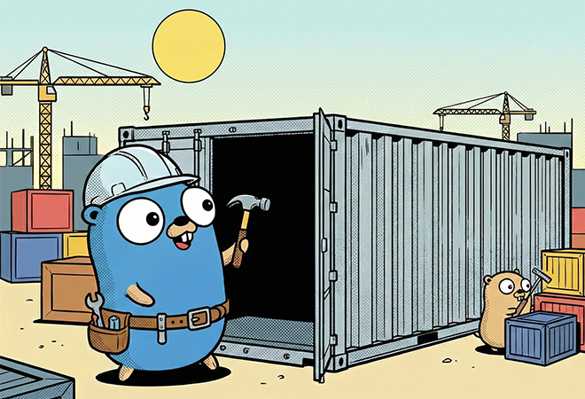

# 低レベルコンテナランタイム自作講座

このリポジトリは、[Go WorkshopConference 2025 IN KOBE](https://gwc.gocon.jp/2025/)にて開催した、
[低レベルコンテナランタイム自作講座 ～コンテナ技術の地盤を理解する～](https://go-workshop-conference.connpass.com/event/375445/)のリポジトリです。



## `./`: ハンズオン用テンプレート

ワークショップのハンズオンパートで使うディレクトリです。

```plain
.
├── main.go         メイン (特にNamespace関連) 処理
├── cgroup.go       cgroup関連処理
├── rootfs.go       rootfs関連処理
├── go.mod
├── go.sum
├── .devcontainer   Dev Container定義ファイル
├── Makefile
│
├── rootfs/         (自動生成) 今回作るコンテナでルートになるディレクトリ
├── config.json     (自動生成) 今回のプログラムの設定ファイル
└── spec/
    └── config.json (自動生成) runcのデフォルトspecファイル
```

### `make`コマンド一覧

- リポジトリの初期化
  - `config.json` (今回のプログラムの設定ファイル) の生成
  - `spec/config.json` (runcのデフォルトspecファイル) の生成

```bash
make init
```

- 作成したプログラムの実行

```bash
make run
```

- `rootfs`ディレクトリの生成
  - `ubuntu:latest`イメージの中身がコピーされます

```bash
make rootfs
```

## `/docs`: 教材

この講座の教材です。  
BunとVitePressでレンダリングすることを前提としています。

```plain
docs
├── 0-intro
├── 1-basics
├── 2-start-handson
├── 3-namespace
├── 4-rootfs
├── 5-cgroup
├── 6-go-beyond
├── index.md
└── public
```

## イベント画像について

- The Go gopher was designed by Renée French.
- 本画像はGoogle Gemini及びNano Banana Proを利用して生成し、Takuto Nagamiが独自に編集を加えたものです。
